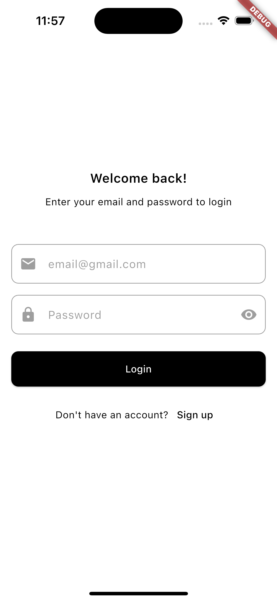
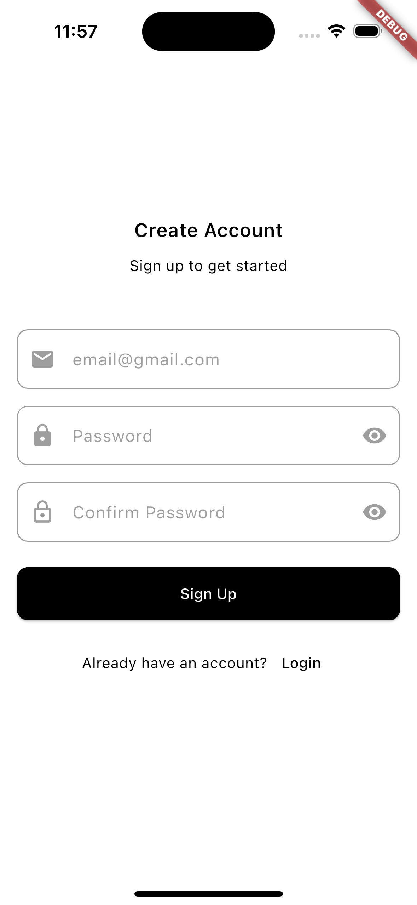
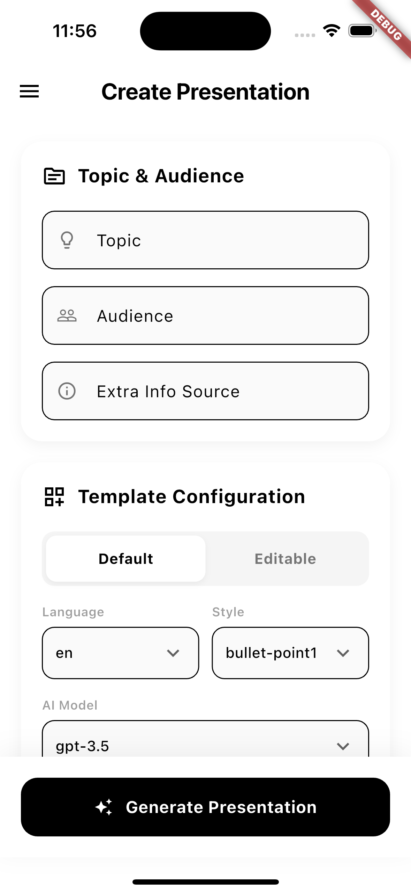
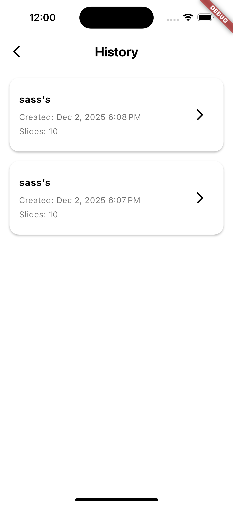

# PPT Generator

A Flutter application that generates PowerPoint presentations using AI.

## Screenshots

| Login | Sign Up | Home Page |
|:---:|:---:|:---:|
|  |  |  |

| Drawer | History |
|:---:|:---:|
|  |  |

## How to Run

### Prerequisites
- Flutter SDK installed
- Supabase account and project setup

### App Setup
1. Ensure you have the `config/secrets.json` file with your Supabase credentials.
2. Run the Flutter app:
   ```bash
   flutter run
   ```

## Database Used

This project uses **Supabase** (PostgreSQL) for:
- **Authentication**: User sign-up and login.
- **Data Storage**:
  - `user_data`: Stores user profile information.
  - `ppt_generation_info`: Logs details of generated presentations.

## Architecture

The application follows **Clean Architecture** principles with **BLoC (Business Logic Component)** for state management.

- **Presentation Layer**: Widgets and BLoCs (e.g., `HomeBloc`, `AuthBloc`).
- **Domain/Data Layer**: Models (e.g., `PptRequestModel`) and Services (e.g., `SupabaseService`, `PptService`).
- **Core**: Constants, Themes, and Configs.

